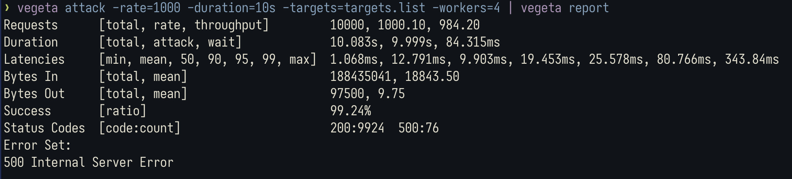

## Запуск

**1. Создать .env файл**

```sh
cp env.template .env
```

**2. Запустить контейнеры**

```sh
docker compose up --build -d
```

или

```sh
make compose-up
```

## Тесты

**Unit-тесты:**

```sh
go test -v -race ./internal/...
```

**Интеграционные тесты:**

```sh
make compose-up-integration-test
```

**Нагрузочный тест:**

1. Запустить контейнеры
2. Создать пользователей (поскольку порядок запросов в тесте не гарантируется)

```sh
curl -X POST \
  http://localhost:8080/api/auth \
  -H 'Content-Type: application/json' \
  -d '{
    "username": "user1",
    "password": "password"
  }'
```

```sh
curl -X POST \
  http://localhost:8080/api/auth \
  -H 'Content-Type: application/json' \
  -d '{
    "username": "user2",
    "password": "password"
  }'
```

3. Запустить тест

```
vegeta attack -rate=1000 -duration=10s -targets=stress-test/targets.list -workers=4 | vegeta report
```

или

```
make stress-test
```

Результаты теста при **1k** RPS:

- среднее время ответа: **12.791ms**
- успешных ответов: **99.92%**


